**Tutor's Pet - User Guide**

1. Table of Contents
{:toc}

## Introduction

Tutor's Pet is a **student management application** for teaching assistants in NUS Computing.
Tutor's Pet reduces the amount of time you spend on administrative tasks as a teaching assistant.
It is a one stop solution to keep track of your classes, students, and their progress.

As a teaching assistant, administrative chores such as attendance taking and grading students' participation
can be troublesome with existing solutions such as spreadsheets. This is why we have created _Tutor's Pet, a
solution for teaching assistants, by students._

   
   Figure 1. Tutor's Pet application.

## About

This user guide provides documentation on the installation and usage of Tutor's Pet.
It also provides a comprehensive description of features available to you and
includes a [quick-start](#quick-start) section that helps you get started.

### Using this guide

The following features are used in this guide to make it easier for you to navigate around:

* Words that look like [this](#using-this-guide) can be clicked to jump to the related section.
* Words that look like `this` refer to keywords used as part of commands or responses from your Tutor's Pet.
* Words that look like <kbd>this</kbd> refer to keyboard keys that you can press.

:information_source: Boxes with the :information_source: icon contain additional useful information.

:bulb: Boxes with the :bulb: icon contain additional tips and tricks to help you get the most out of your Tutor's Pet.

:warning: Boxes with the :warning: icon contain important information about how to keep your Tutor's Pet data safe.

--------------------------------------------------------------------------------------------------------------------

## Quick start
### Installing Tutor's Pet

Here are a few steps to get you started on Tutor's Pet:

1. Ensure you have **Java 11** or above installed in your Computer.

2. Download the latest **tutorspet.jar** [here](https://github.com/AY2021S1-CS2103T-T10-4/tp/releases).

3. Copy the file to the folder you want to use as the home folder for your Tutor's Pet.

4. Double-click the file to start the application. An application similar to the one below should appear in a few
   seconds. 

   
   Figure 2. Tutor's Pet application.

### Using Tutor's Pet

This section offers an overview of Tutor's Pet layout.

There are three main areas in Tutor's Pet:

1. A command box and result display box.

2. A main viewing area.

3. A utility area.

The command box is the area for you to enter your commands. The result of each command would be shown in the result
display box, which is located immediately below the command box.

   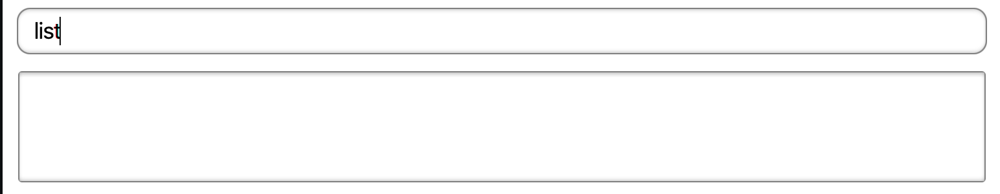
    Figure 3. The command box and result display box.

* Type a command in the command box and press <kbd>Enter</kbd> to execute it. 
   e.g. Type **`help`** and press <kbd>Enter</kbd> to open the help window. 

   Some example commands you can try:

   * **`list`** : Lists all students and classes.

   * **`add-student`**`n\John Doe t\johndoe e\johnd@example.com tag\student` : Adds a student named `John Doe`
   to the application.

   * **`delete-student`**`3` : Deletes the 3rd student shown in the current list.

   * **`clear-student`** : Deletes all students.

   * **`exit`** : Exits the app.

* Refer to the [Features](#features) below for details of each command.

The main viewing area consists of two sections: **Classes** and **Students**.

* The **Classes** section contains information about classes and lessons in Tutor's Pet. Use the **`list-class`** command to view the list of all
classes in Tutor's Pet.

    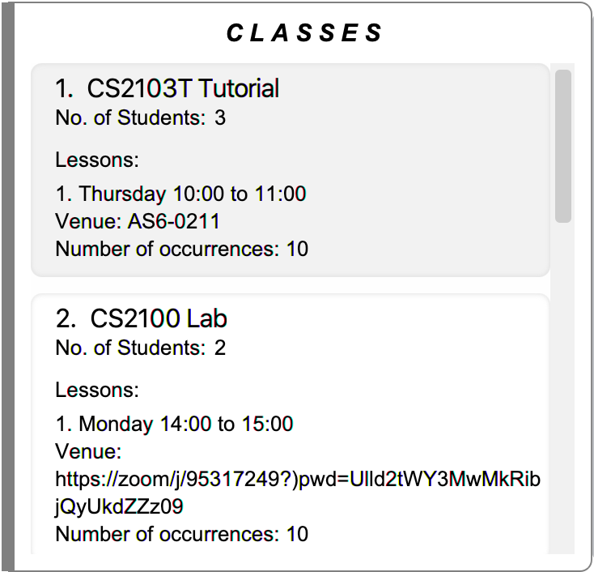
     Figure 4. The class section.

* The **Students** section displays contains information about students in Tutor's Pet. Use the **`list-student`** command to view the list of all students in Tutor's Pet.

    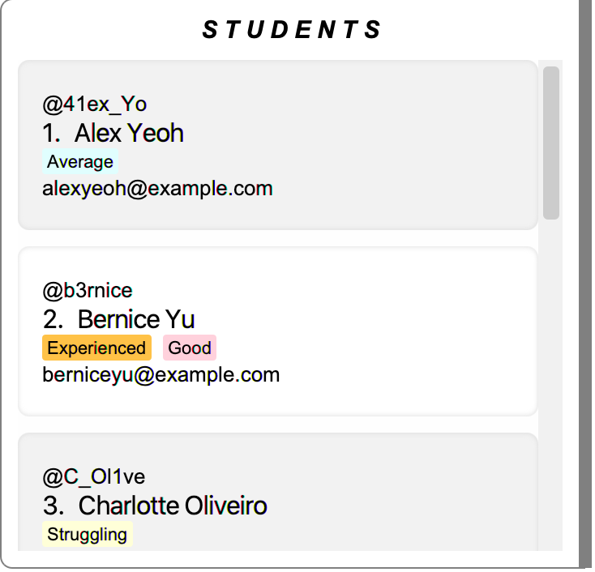
     Figure 5. The student section.

The utility area consists of three tabs: **File**, **Theme**, **Help**.

  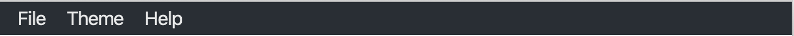
   Figure 6. The utility area.

* The **File** tab consists of an exit button. To exit Tutor's Pet, click on the exit button. Alternatively, use the `exit` command to exit the application.

* The **Theme** tab consist of 3 different themes: **Light**, **Alternate** and **Dark**. To change the theme of
 your Tutor's Pet, click on one of these buttons.

     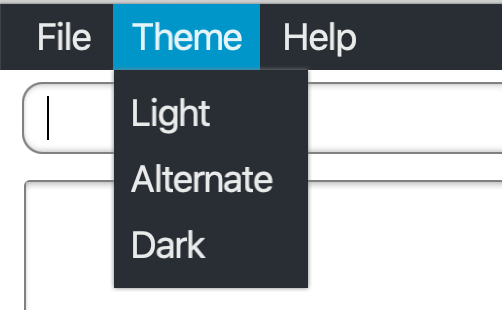
      Figure 7. The theme tab.

* The **Help** tab consists of a help button. If you require any assistance, click on the help button, copy the link
 given and paste it into any web browser. Alternatively, press <kbd>F1</kbd> to bring up the help window.

--------------------------------------------------------------------------------------------------------------------

## Command format

**:information_source: Notes about the command format:** 

This section details the format of the commands available in Tutor's Pet. We will adhere to the following:

* Words in `↑PER_CASE` are the parameters to be supplied by the user. 
  e.g. in `add-student n\NAME`, `NAME` is a parameter which can be used as `add-student n\John Doe`.

* Items in square brackets are optional. 
  e.g `n\NAME [tag\TAG]` can be used as `n\John Doe tag\student` or as `n\John Doe`.

* Items with `…` after them can be used multiple times including zero times. 
  e.g. `[tag\TAG]…` can be used as ` ` (i.e. 0 times), `tag\student`, `tag\average tag\TA candidate` etc.

* Parameters can be in any order. 
  e.g. if the command specifies `n\NAME t\TELEGRAM_USERNAME`, `t\TELEGRAM_USERNAME n\NAME` is also acceptable.

* Indexes **must be a positive whole number** 1, 2, 3, …

## Command overview
This section provides an overview of all commands in Tutor's Pet and illustrates the usage of each command in detail.

| Action                            | Format                                                                                      | Example (if applicable)                                            |
|-----------------------------------|---------------------------------------------------------------------------------------------|--------------------------------------------------------------------|
| **Add Attendance Record**         | `add-attendance c\CLASS_INDEX l\LESSON_INDEX s\STUDENT_INDEX w\WEEK p\PARTICIPATION_SCORE`  | `add-attendance c\1 l\1 s\1 w\1 p\1`                               |
| **Add Class**                     | `add-class n\CLASS_NAME`                                                                    | `add-class n\CS2103T Tutorial T10`                                 |
| **Add Lesson**                    | `add-lesson c\CLASS_INDEX d\DAY st\START_TIME et\END_TIME v\VENUE r\NO_OF_TIMES`            | `add-lesson c\1 d\MONDAY st\0800 et\1000 v\COM1 #01-01 r\13`       |
| **Add Student**                   | `add-student n\NAME t\TELEGRAM_USERNAME e\EMAIL [tag\TAG]…`                                 | `add-student n\John Doe t\johndoe e\johnd@example.com tag\student` |
| **Clear All Classes**             | `clear-class`                                                                               |                                                                    |
| **Clear All Students**            | `clear-student`                                                                             |                                                                    |
| **Delete Attendance Record**      | `delete-attendance c\CLASS_INDEX l\LESSON_INDEX s\STUDENT_INDEX w\WEEK`                     | `delete-attendance c\1 l\1 s\1 w\1`                                |
| **Delete Class**                  | `delete-class CLASS_INDEX`                                                                  | `delete-class 2`                                                   |
| **Delete Lesson**                 | `delete-lesson c\CLASS_INDEX l\LESSON_INDEX`                                                | `delete-lesson c\1 l\1`                                            |
| **Delete Student**                | `delete-student STUDENT_INDEX`                                                              | `delete-student 3`                                                 |
| **Display Statistics**            | `stats c\CLASS_INDEX s\STUDENT_INDEX`                                                       | `stats c\1 s\1`                                                    |
| **Display Venue**                 | `display-venue c\CLASS_INDEX l\LESSON_INDEX`                                                | `display-venue c\1 l\1`                                            |
| **Edit Attendance Record**        | `edit-attendance c\CLASS_INDEX l\LESSON_INDEX s\STUDENT_INDEX w\WEEK p\PARTICIPATION_SCORE` | `edit-attendance c\1 l\1 s\1 w\1 p\10`                             |
| **Edit Class**                    | `edit-class CLASS_INDEX n\CLASS_NAME`                                                       | `edit-class 1 n\CS2103T Tutorial T10`                              |
| **Edit Lesson**                   | `edit-lesson c\CLASS_INDEX l\LESSON_INDEX [d\DAY] [st\START_TIME] [et\END_TIME] [v\VENUE]`  | `edit-lesson c\1 l\1 d\TUESDAY st\1000 et\1200 v\COM2 #02-02`      |
| **Edit Student**                  | `edit-student STUDENT_INDEX [n\NAME] [t\TELEGRAM_USERNAME] [e\EMAIL] [tag\TAG]…`            | `edit-student 2 n\James Lee e\jameslee@example.com`                |
| **Exit**                          | `exit`                                                                                      |                                                                    |
| **Find Attendance Record**        | `find-attendance c\CLASS_INDEX l\LESSON_INDEX s\STUDENT_INDEX w\WEEK`                       | `find-attendance c\1 l\1 s\1 w\1`                                  |
| **Find Class**                    | `find-class KEYWORD [MORE_KEYWORDS]`                                                        | `find-class CS2103T`                                               |
| **Find Student**                  | `find-student KEYWORD [MORE_KEYWORDS]`                                                      | `find-student James Jake`                                          |
| **Help**                          | `help`                                                                                      |                                                                    |
| **Linking Student To A Class**    | `link s\STUDENT_INDEX c\CLASS_INDEX`                                                        | `link s\1 c\2`                                                     |
| **List All Classes**              | `list-class`                                                                                |                                                                    |
| **List All Students**             | `list-student`                                                                              |                                                                    |
| **List All Students And Classes** | `list`                                                                                      |                                                                    |
| **List Students In A Class**      | `list-student c\CLASS_INDEX`                                                                | `list-student c\3`                                                 |
| **Redo**                          | `redo`                                                                                      |                                                                    |
| **Reset**                         | `reset`                                                                                     |                                                                    |
| **Undo**                          | `undo`                                                                                      |                                                                    |
| **Unlink Student From A Class**   | `unlink s\STUDENT_INDEX c\CLASS_INDEX`                                                      | `unlink s\1 c\2`                                                   |
| **View Change History**           | `view-history`                                                                              |                                                                    |

The following subsections will elaborate on the specific details of each Tutor's Pet command.

### General

#### Viewing help : `help`

If you require any assistance, you can use this command which shows you the link to user guide.

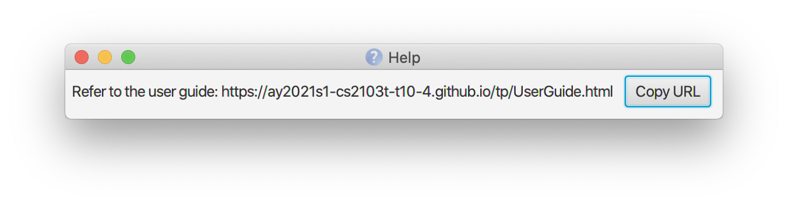

**Format**: `help`

#### Undoing previous changes : `undo`

If you have accidentally entered a command that permanently changes the data in your Tutor's Pet,
you can use this command to undo the changes.

**Format**: `undo`

For example:

* You want to delete Alex from your Tutor's Pet, however you accidentally deleted Bernice instead of Alex.

* You type in the command `undo` and press <kbd>Enter</kbd>.
   

* Bernice has been undeleted and now you can [delete](#deleting-a-student--delete-student) Alex.
   

:bulb: **Tip:** To view a list of changes that can be undone, use the [`view-history` command](#view-change-history--view-history).

#### Redoing previously undone changes : `redo`

If you decide that you did not need to undo a command, instead of typing out the command again, you can use
this command to redo the changes.

**Format** : `redo`

#### View change history : `view-history`

You can use this command to see a list of changes that can be undone and redone.

**Format** : `view-history`

For example:

* You are marking the attendance of your students but accidentally lost track of which student you were at.

* Type `view-history` into the command box and press <kbd>Enter</kbd>.

  

* The result box will display a list of changes with the latest shown at the top.

  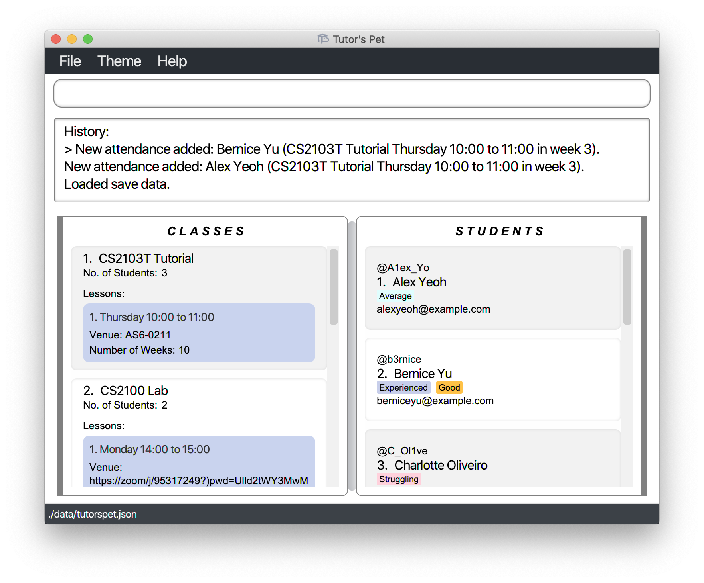

:bulb: **Tip:**
The `>` indicator shows which point of your Tutor's Pet history is currently being displayed.
You can use this feature to check if there are any changes that you can undo or redo.

The diagram below shows an example where the last change has been undone. 
*Notice how the `>` indicator now points to the second change listed.*

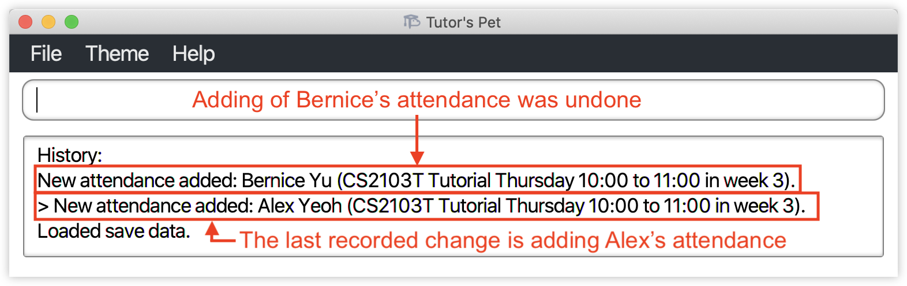

#### Exiting the program : `exit`

You can exit Tutor's Pet by typing this command.
All changes you have made to your Tutor's Pet would have been saved.

**Format**: `exit`

#### Resetting the program : `reset`

You can use this command to reset Tutor's Pet and all data will be cleared.

**Format**: `reset`

For example:
* It is the start of a new semester and you want to delete all students and classes.
  You can type in the command `reset` and press <kbd>Enter</kbd>.

* You can see that all students and classes have been deleted.

  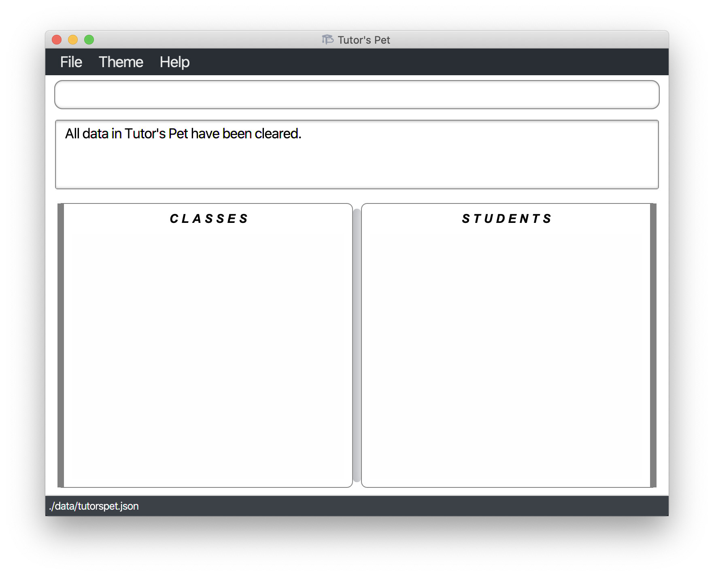

#### Recalling previously entered commands

If you have to enter a similar command repeatedly, you can use this feature to type less.

When the [command box](#using-tutors-pet) is selected, press the <kbd>↑</kbd> and <kbd>↓</kbd> keys to cycle through previously entered commands.

For example:

* You are taking the attendance for one of your lessons, CS2103T Tutorial.
  You have just [recorded the attendance](#adding-an-attendance-record--add-attendance) of the first student.

* Instead of typing the whole command from the beginning, you can **press** the <kbd>↑</kbd> key.

* The previous command will be displayed in the command box.

* Now you can edit the command to record the attendance of other students.

#### Saving the data

Tutor's Pet automatically saves your data to your home folder after any changes are made.
There is no need for you to save manually.

### Managing students

#### Adding a student : `add-student`

If you would like to add a student to Tutor's Pet, use this command.

**Format**: `add-student n\NAME t\TELEGRAM_USERNAME e\EMAIL [tag\TAG]…​`

For example:
* You would like to add a new student, `Joel Lee` to Tutor's Pet.
  Type in `add-student n\Joel Lee t\joeleee e\jlee@example.com`
* Scrolling down the list of students, you will see that `Joel Lee` has been added to Tutor's Pet.

  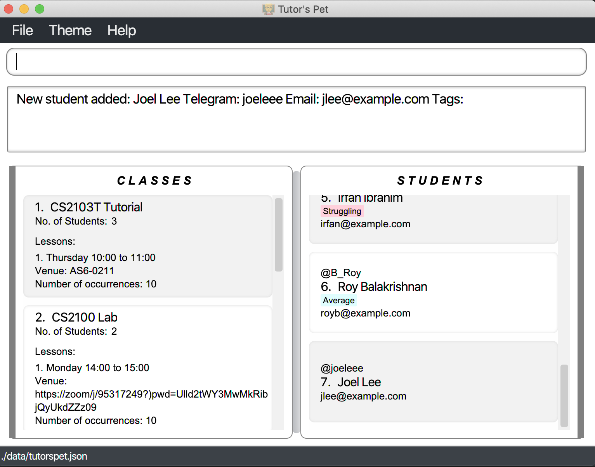

Other examples:
* `add-student n\Betsy Crowe t\betsycrowe e\betsycrowe@example.com tag\excellent` \
Adds `Betsy` to Tutor's Pet along with an `excellent` tag.

:bulb: **Tip:** A student can have any number of tags (including 0)

#### Listing all students : `list-student`

If you would like to view all students you teach, use this command.

**Format**: `list-student`

#### Editing a student : `edit-student`

If you would like to change a student's particulars, use this command.

**Format**: `edit-student STUDENT_INDEX [n\NAME] [t\TELEGRAM_USERNAME] [e\EMAIL] [tag\TAG]…​`

For example:
* `Charlotte Oliveiro` gave you the wrong email address on the first day of class. You need to replace her email address.
  Type in `edit-student 3 e\charlotteolive@example.com` and press <kbd>Enter</kbd>.
* Scrolling down the list of students, you can see that `Charlotte`'s email has changed to `charlotteolive@example.com`.

  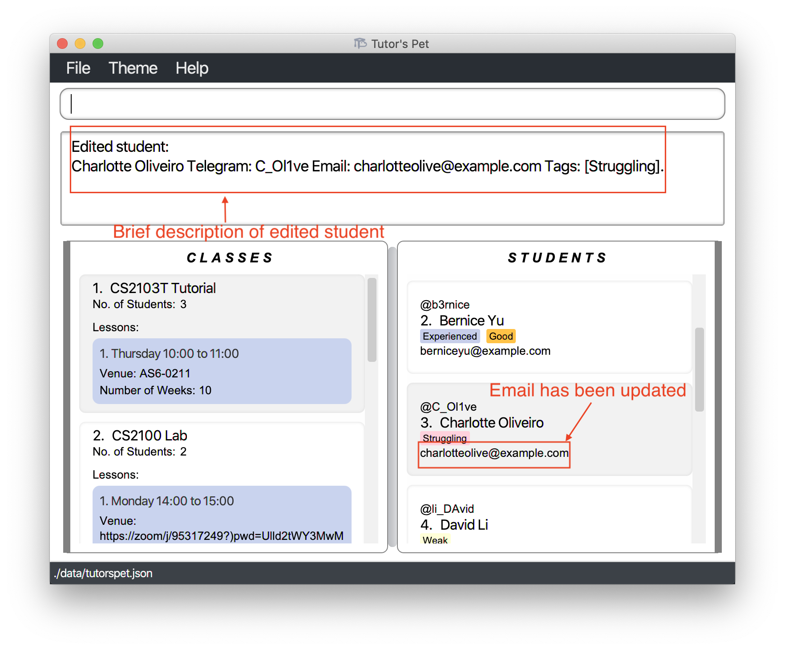

Constraints:
* You must provide at least one of the optional fields.
* When editing tags, the existing tags of the student will be removed and replaced by the newly typed in tags.
* You can remove all the tags of a student by typing `tag\` without specifying any tags after it.

Other examples:
*  `edit-student 1 t\smartlex e\yeohalex@example.com` \
Edits the telegram username and email address of the 1st student to `smartlex` and `yeohalex@example.com` respectively.
*  `edit-student 2 n\Betsy Yu tag\` \
Edits the name of the 2nd student to `Betsy Yu` and deletes all existing tags.

#### Finding student by name : `find-student`

If you would like to search for a student by name, use this command.

**Format**: `find-student KEYWORD [MORE_KEYWORDS]`

For example:
* `Roy` requested for supplementary notes in class today.
You want to email him these notes.
  Type `find-student roy` and press <kbd>Enter</kbd>.

  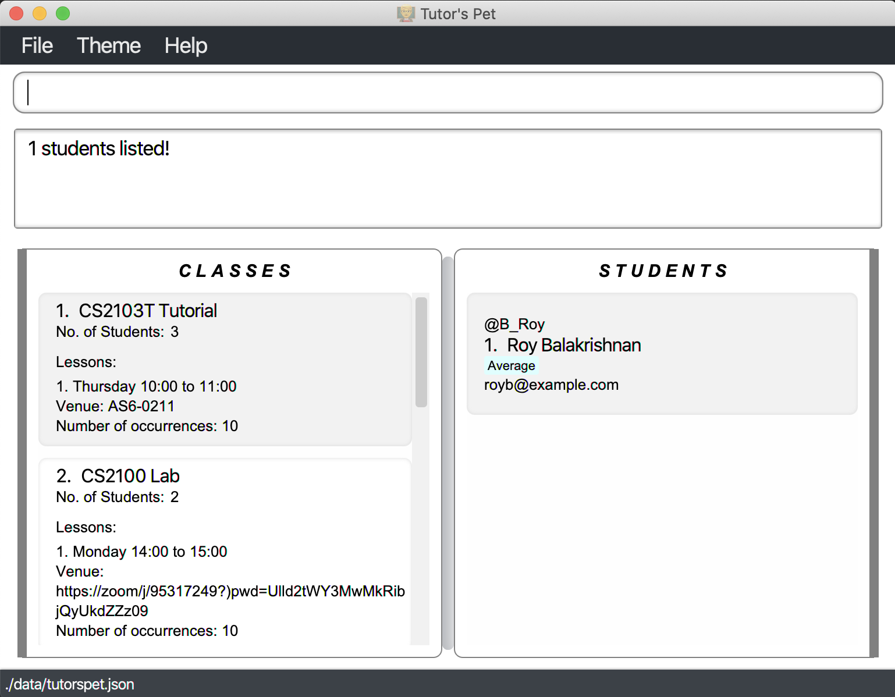

Constraints:
* The search is case-insensitive. You will receive `Roy` if you type in `roy`.
* The order of the keywords does not matter. You will receive `Alex Yeoh` if you type in `Yeoh Alex`.
* Only the name is searched.
* Only full words will be matched. You will not receive `Irfan` if you only typed in `Irfa`.
* Students matching at least one keyword will be returned. You will receive both `Alex Yeoh` and `David Li` if you type in `Alex Li`.

#### Deleting a student : `delete-student`

If you would like to delete a student, you can make use of this command.

**Format**: `delete-student STUDENT_INDEX`

For example:
* `Bernice`, the 2nd student displayed in Tutor's Pet, has swapped `CS2103T Tutorial` slots and you no longer teach her.
Hence, you want to delete her entry from Tutor's Pet.
  You type in `delete-student 2` and press <kbd>Enter</kbd>.
* Notice that the number of students in `CS2103T Tutorial` decreases to 2.

  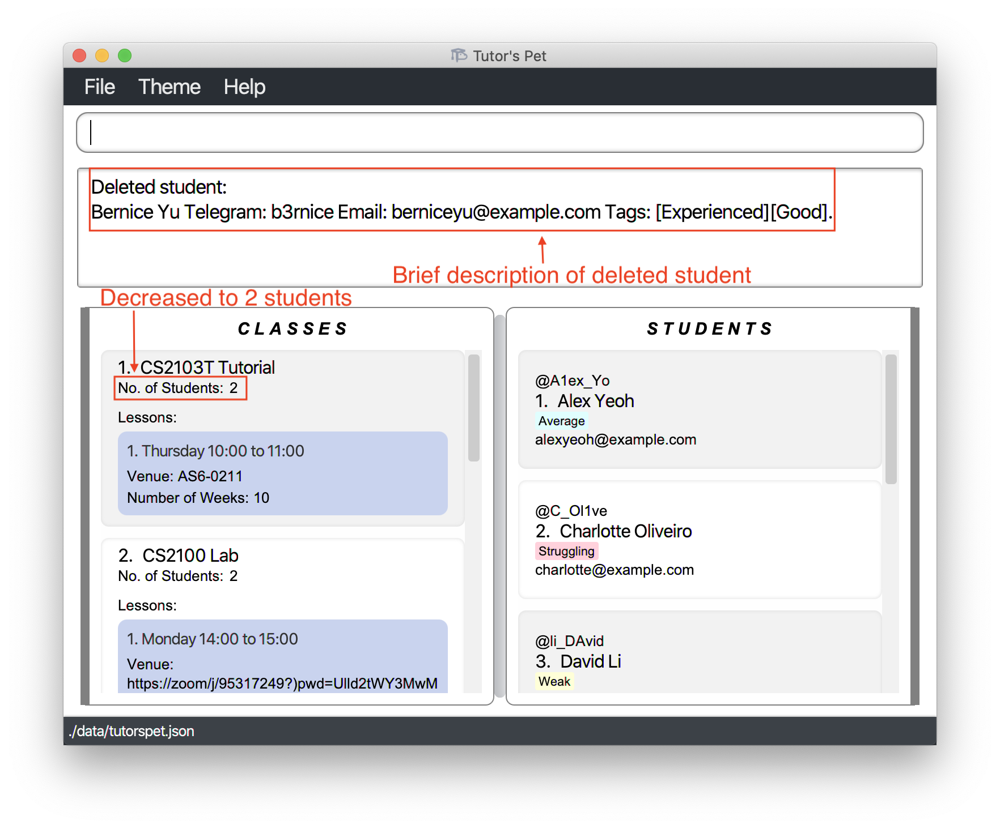

#### Clearing all students : `clear-student`

If you would like to delete all students in the application, you can use this command.

**Format**: `clear-student`

### Managing classes

#### Adding a class : `add-class`

If you would like to add a new class, you can make use of this command.

**Format**: `add-class n\CLASS_NAME`
* Adds a class with the specified `CLASS_NAME`.

For example:
* You have just been allocated to teach a tutorial class, Tutorial 3, in the module CS1231.
Hence, you decide to add this new tutorial class to your Tutor's Pet.
You type `add-class n\CS1231 Tutorial 3` and press <kbd>Enter</kbd>.

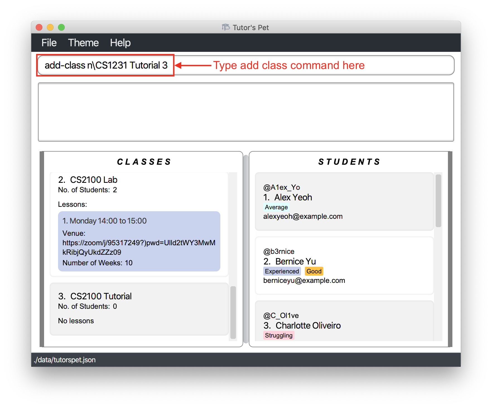

* The class has been added, and you can see it in the displayed class list.

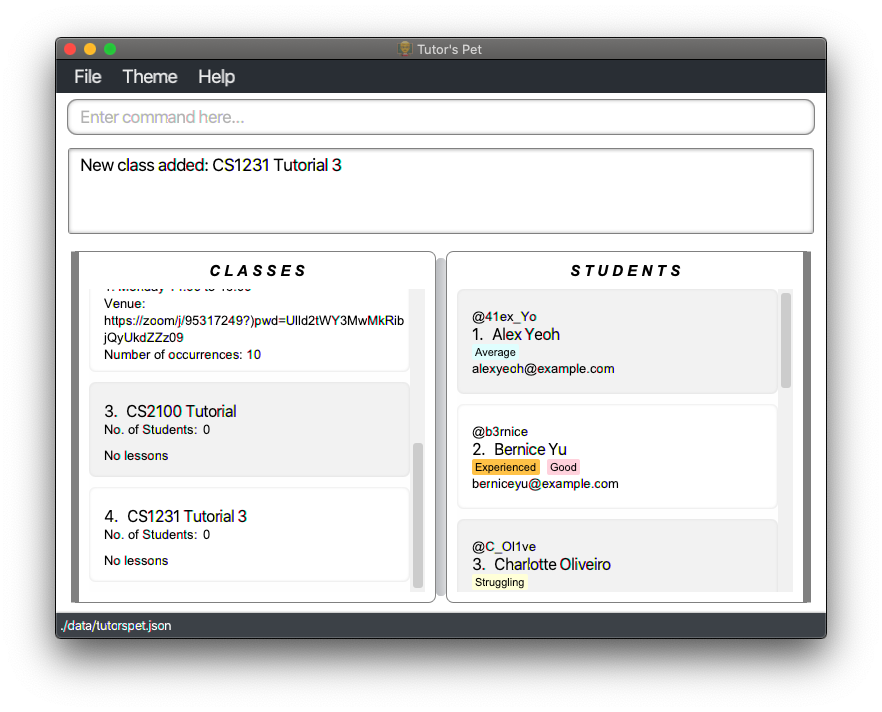

:information_source: **Notes about the command:**
* The class name can only contain alphabets, numbers and spaces.
* The class name cannot be the same as an existing class in your Tutor's Pet.

#### Listing all classes : `list-class`

If you would like to see a list of all classes in your Tutor's Pet, make use of this command.

**Format**: `list-class`

#### Listing all students within a class : `list-student`

If you would like to see a list of all students in a particular class, make use of this command.

**Format**: `list-student c\CLASS_INDEX`

For example:
* You want to send an email to students in your `CS2103T Tutorial` and hence would want to see a list of students in
this class. You type in the command `list-student c\1` and and press <kbd>Enter</kbd>.

* You can see that the 3 students in your `CS2103T Tutorial` have been listed.

  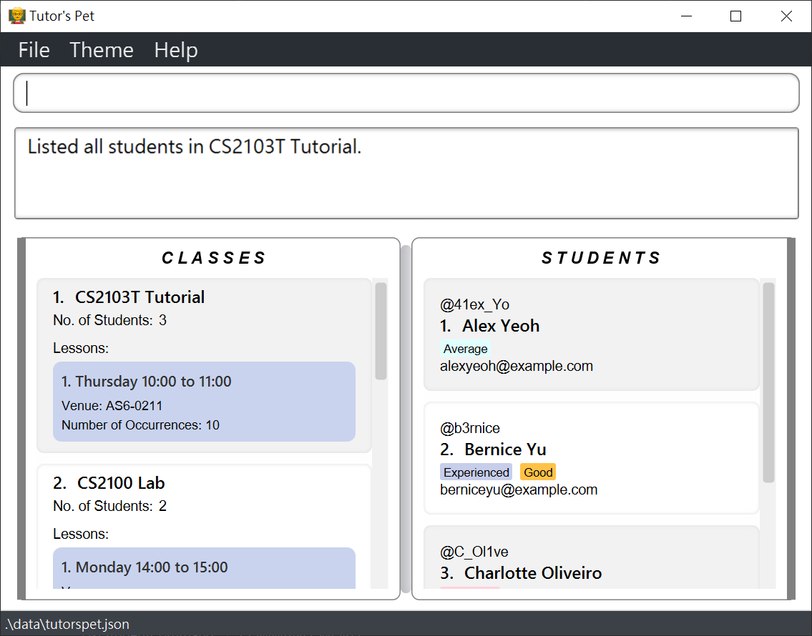

Other examples:
* `list-student c\3`  
  Lists all students in 3rd class.

#### Editing a class : `edit-class`

If you entered the wrong class name or would like to change the name of a class, you can make use of this command.

**Format**: `edit-class CLASS_INDEX n\CLASS_NAME`
* Edits the class at the specified `INDEX`.

For example:
* Your module coordinator decides to allocate another class to you and you want to be able to distinguish between
 the two classes. Hence you decide to edit the `CS2103T Tutorial` class to `CS2103T Tutorial T10`. You type the
 command `edit-class 1 n\CS2103T Tutorial T10` and press <kbd>Enter</kbd>.
* The class has been renamed from `CS2103T Tutorial` to `CS2103T Tutorial 10`.

    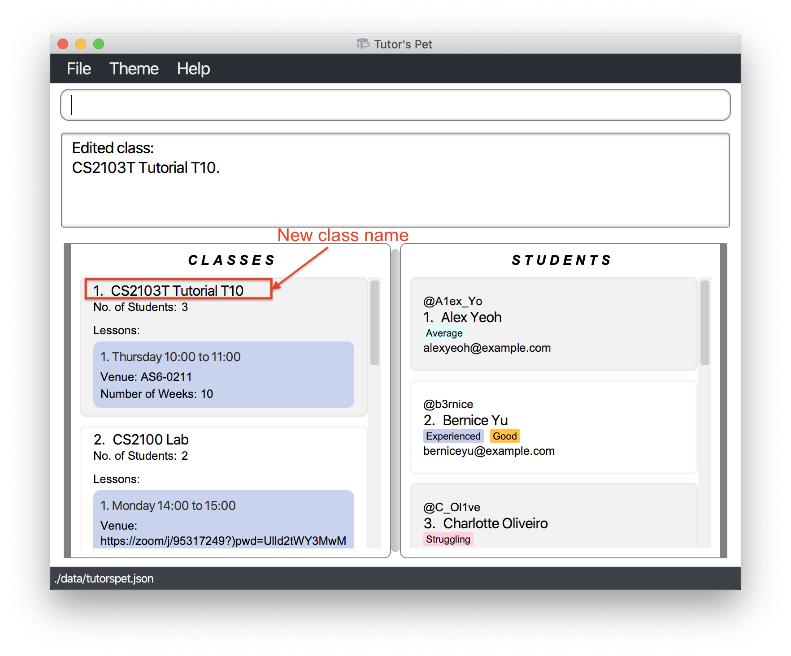

Constraints:
* A new class name must be provided.

Other examples:
* `find-class CS2030 lab` 
  `edit-class 1 n\CS2030 lab L05` 
  Edits the name of the 1st class in the results of the find command.

:bulb: **Tip:** Make use of the find-class command to filter the displayed student class list to your
desired class. You can now type in index 1 directly to edit the name of that class.

#### Finding class by name : `find-class`

If you would like to find classes that contain any of the given keywords in their name, make use of this command.

**Format**: `find-class KEYWORD [MORE_KEYWORDS]`

For example:
* You would like to find out how many `Tutorial` classes you are currently teaching. You type the command
 `find-class Tutorial` and press <kbd>Enter</kbd>.
* You find out that you are only teaching 2 tutorials this semester and hence decide to accept more classes.

    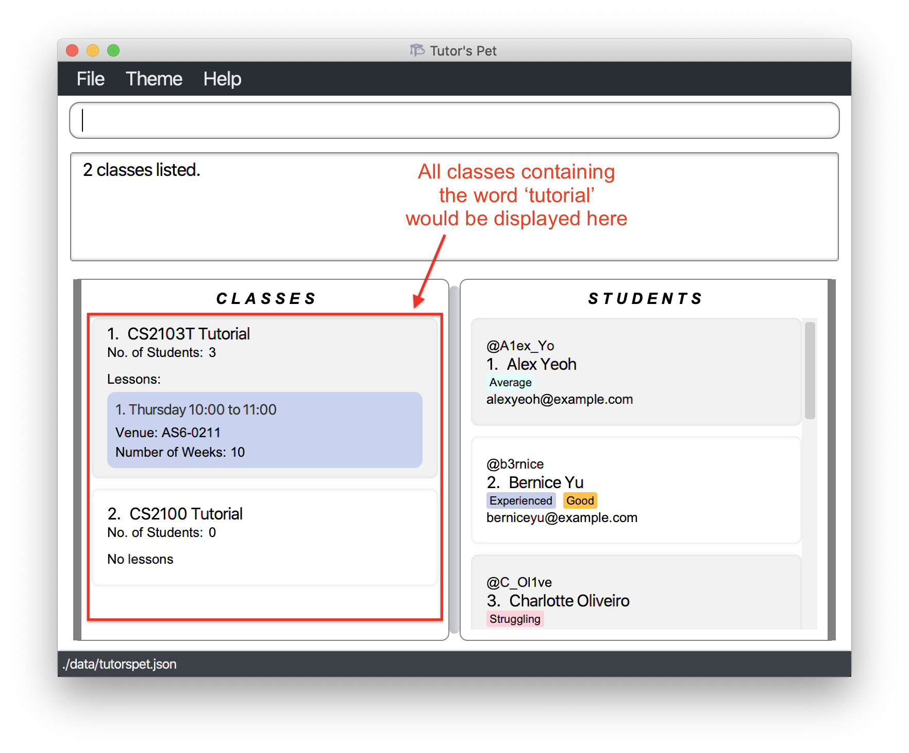

Other examples:
* `find-class CS2100` 
    Returns `CS2100 tut` and `CS2100 lab`
* `find-class tut CS2030` 
    Returns `CS2103T tut`, `CS2030 lab`

**:information_source: Notes about the command:** 

* The search is case-insensitive. e.g `cs2103t` will match `CS2103T`.

* The order of the keywords does not matter. e.g. `lab CS2100` will match `CS2100 lab`.

* Only the name is searched.

* Only full words will be matched e.g. `CS` will not match `CS2100`.

* Students matching at least one keyword will be returned (i.e. **OR** search).
    e.g. `CS2103T lab` will return `CS2103T tut`, `CS2100 lab`.

#### Deleting a class : `delete-class`

If you would like to delete a class, you can make use of this command.

**Format**: `delete-class INDEX`
* Deletes the class at the specified `INDEX`.

For example:
* You have just received news that one of your classes, CS2100 Lab, has been permanently removed due to low enrollment.
Hence, you want to delete the class from your Tutor's Pet.
You type the command `delete-class 2` and press <kbd>Enter</kbd>.

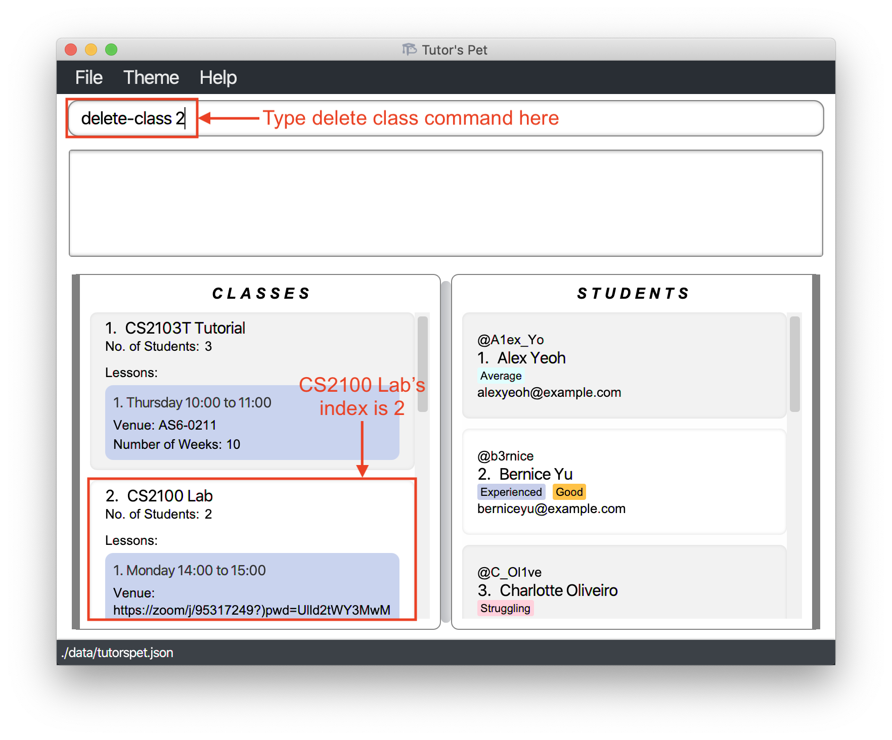

* The class has been successfully deleted.

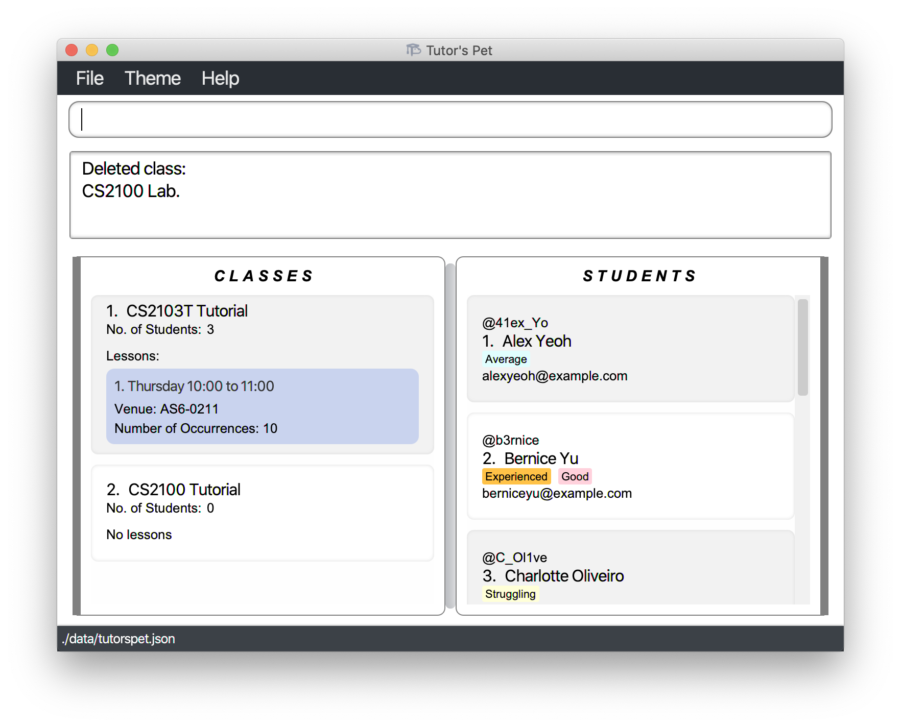

Other examples:
* `find-class CS2030 lab` 
  `delete-class 1` 
  Deletes the 1st class in the results of the find class command.

#### Clearing all classes : `clear-class`

If you would like to delete all the classes in Tutor's Pet, make use of this command.

**Format**: `clear-class`

For example:
* It is the start of a new semester. You would like to delete all information of all the classes you taught last
 semester to start anew. You type the command `clear-class` and press <kbd>Enter</kbd>.

* All classes have been cleared. You can start managing your new classes.

    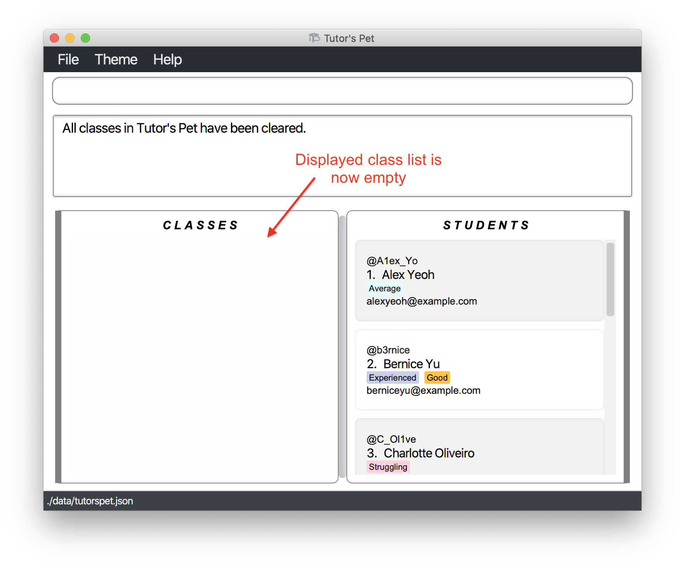

#### Listing all students and classes : `list`

You can use this command to see the entire list of students and classes.

**Format**: `list`

For example:
* After finding the class CS2103T and student Alex, you wish to view all your students and classes.
Hence, you can type in the command `list` and and press <kbd>Enter</kbd>.

  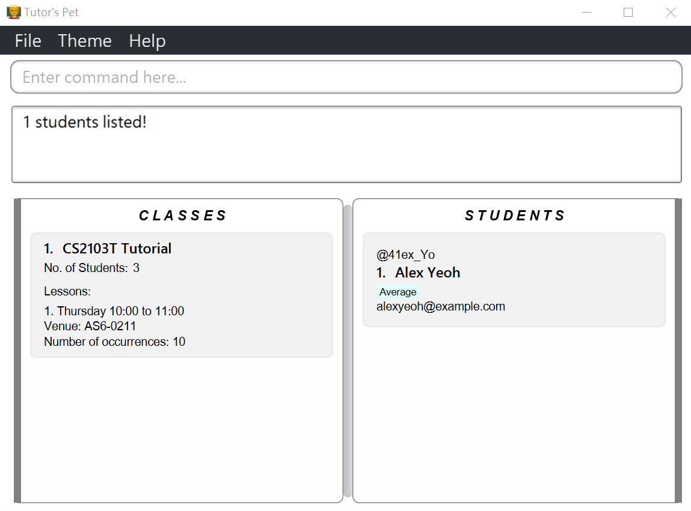

* Now you can see all your students and classes.

  

#### Linking a student to a class : `link`

You can organise students into their classes using this command.
In Tutor's Pet this is known as "linking" a student to a class.

**Format**: `link s\STUDENT_INDEX c\CLASS_INDEX`
* Links the student at the specified `STUDENT_INDEX` to the class at the specified `CLASS_INDEX`.

For example:
* You have a new student, David Li, who has transferred into one of your classes, CS2103T Tutorial.
  You have already [added](#adding-a-student--add-student) him to your Tutor's Pet, and want
  to link him to the class.

* Type in the command `link s\4 c\1` and press <kbd>Enter</kbd>.

  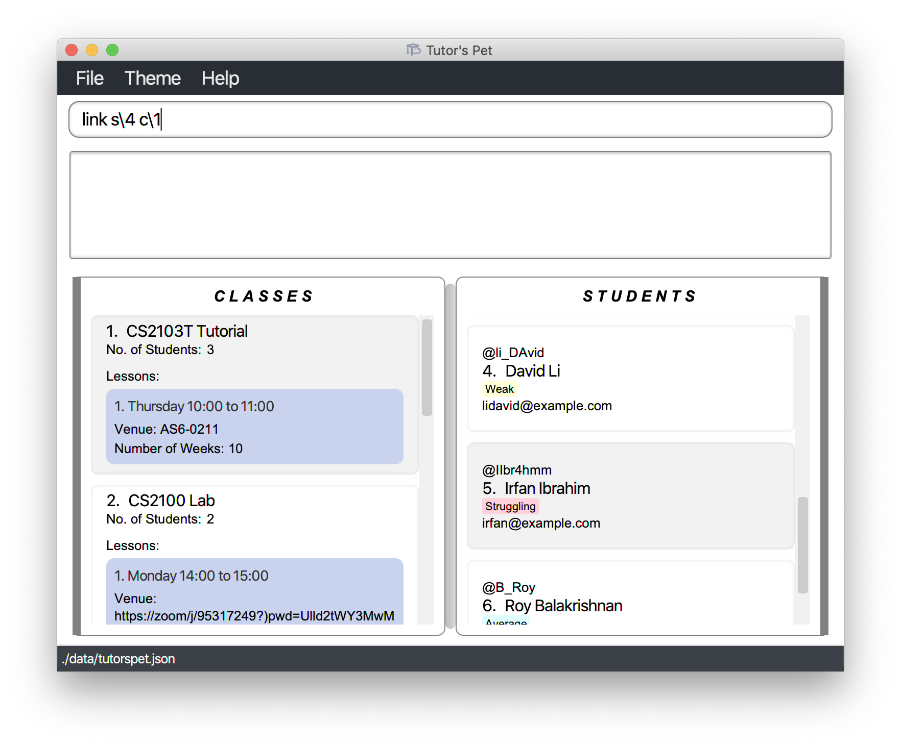

* Your Tutor's Pet displays the students in CS2103T Tutorial to confirm that you have successfully linked
  David to the class.

  

:bulb: **Tip:** When linking multiple students to a class, you can press the <kbd>↑</kbd> key to retrieve previously
entered commands. This reduces the amount you need to type.

Other examples:
* `find-student Alex` 
  `link s\1 c\2` 
  Links the 1st result of the find student command to the 2nd class in the displayed class list.

#### Unlinking a student from a class : `unlink`

You can unlink a student from a class using this command.

**Format**: `unlink s\STUDENT_INDEX c\CLASS_INDEX`
* Unlinks the student at the specified `STUDENT_INDEX` from the class at the specified `CLASS_INDEX`.

For example:
* One of your students, Alex Yeoh, has transferred out of your class, CS2103T Tutorial, and you decide to remove him from the class.

* Type in the command `unlink s\1 c\1` and press <kbd>Enter</kbd>.

  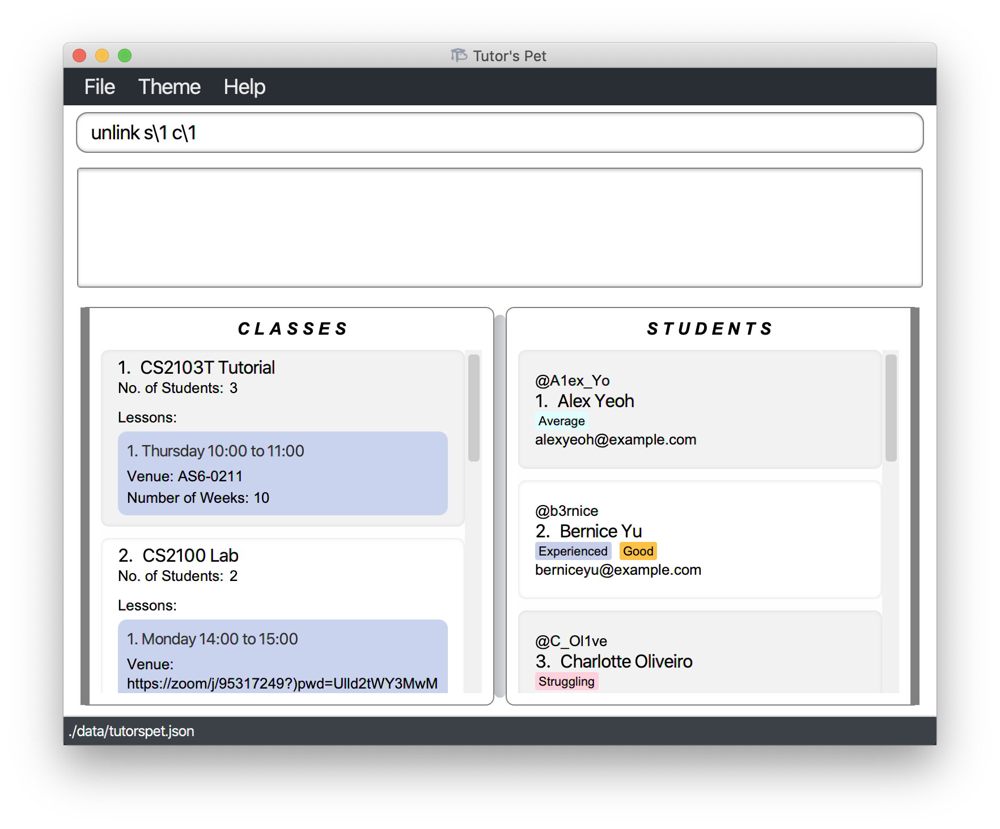

* Your Tutor's Pet displays the remaining students in CS2103T Tutorial to confirm that you have successfully unlinked
  Alex from the class.

  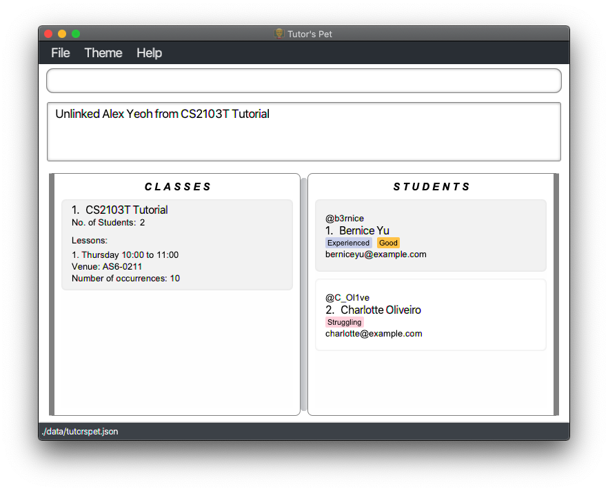

:warning: **Caution:** The student's attendance in the class will also be deleted.

Other examples:
* `list-student c\2` 
  `unlink s\1 c\1` 
  [Lists the students](#listing-all-students-within-a-class--list-student) of the 2nd class in the displayed class list, and unlinks the 2nd student of that class.

### Managing lessons

#### Adding a lesson : `add-lesson` --- Jun Long

If you would like to add a lesson to a class, you can make use of this command.

**Format**: `add-lesson c\CLASS_INDEX d\DAY st\START_TIME et\END_TIME v\VENUE r\NO_OF_TIMES`
* Adds a lesson at a specified `CLASS_INDEX`+ `DAY` + `START_TIME` + `END_TIME` + `VENUE` + `NO_OF_TIMES`.

For example:
* You receive news that you will be teaching `CS2103T Tutorial` on `Tuesday 10:00-11:00` at `COM2 #02-02` from week 1 to 13.
Hence, you type in the command `add-lesson c\1 d\TUESDAY st\10:00 et\11:00 v\COM2 #02-02 r\13` and press <kbd>Enter</kbd>.
* You have added a lesson to teach.

    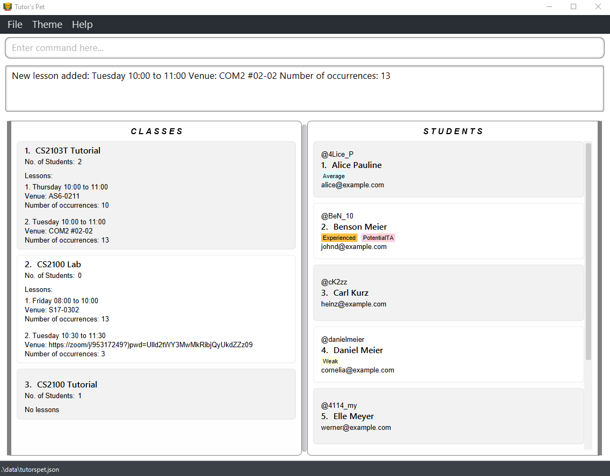

#### Editing a lesson : `edit-lesson`

If you entered wrong details pertaining to your lesson and would like to change it, you can make use of this command.

**Format**: `edit-lesson c\CLASS_INDEX l\LESSON_INDEX [d\DAY] [st\START_TIME] [et\END_TIME] [v\VENUE]`

For example:
* You made an error while entering the `CS2103T Tutorial` lesson. It should be `Tuesday` and not `Thursday`.
* Type the command `edit-lesson c\1 l\1 d\Tuesday` and press <kbd>Enter</kbd>.
* The day of the lesson has been changed to `Tuesday`.

  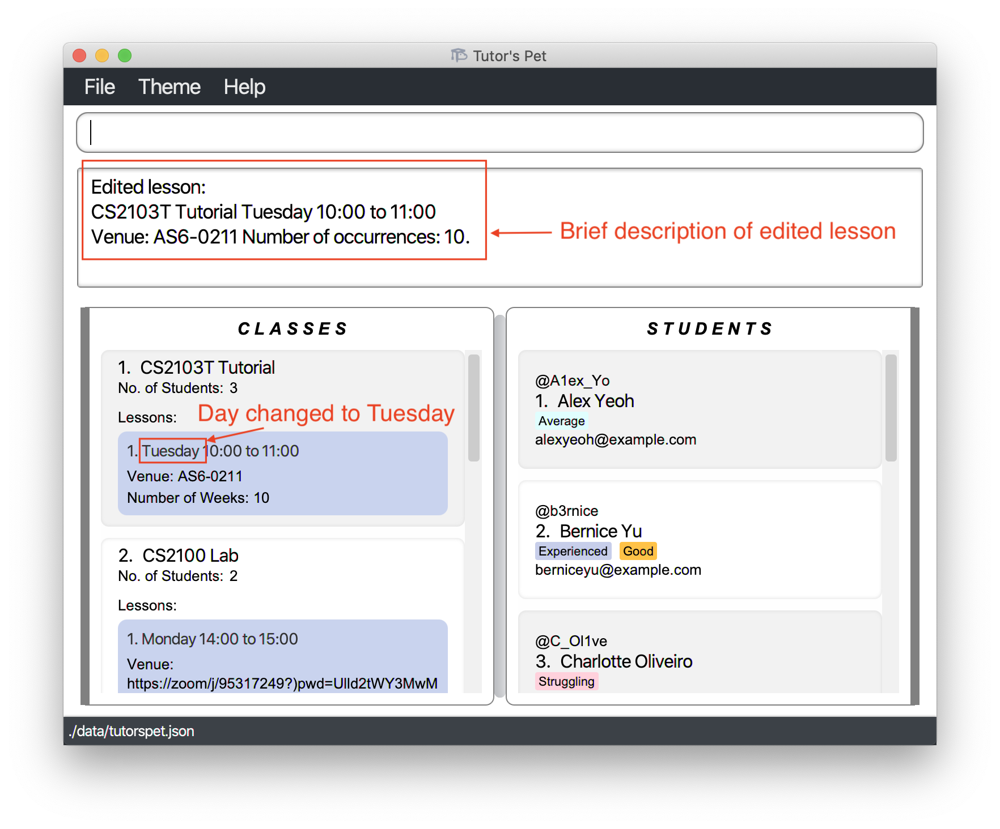

Constraints:
* You must type out the day in full.
* When typing the start and end times, you must follow the form `hh:mm`. For example, `11:00` is allowed, but not `1100`.
* You must specify at least one field (DAY, START_TIME, END_TIME, VENUE) to be changed.
* You are not able to change the Number of occurrences.

Other examples:
*  `find-class CS2100 lab`\
`edit-lesson c\1 l\1 d\TUESDAY st\10:00 et\12:00 v\COM2 #02-02`\
Edits the 1st lesson of the CS2100 lab to be held on Tuesdays, 10.00AM to 12.00PM at COM2 #02-02.

#### Deleting a lesson : `delete-lesson`

If you would like to delete a lesson in a class, you can make use of this command.

**Format**: `delete-lesson c\CLASS_INDEX l\LESSON_INDEX`
* Deletes the lesson at the specified `CLASS_INDEX` + `LESSON_INDEX`.

For example:
* You receive news that the `Tuesday 10:00-11:00` `CS2103T Tutorial` would be cancelled permanently. You decide to
 remove that lesson from your Tutor's Pet and hence you type in the command `delete-lesson c\1 l\2` and press
 <kbd>Enter</kbd>.
* You have one less lesson to teach now.

    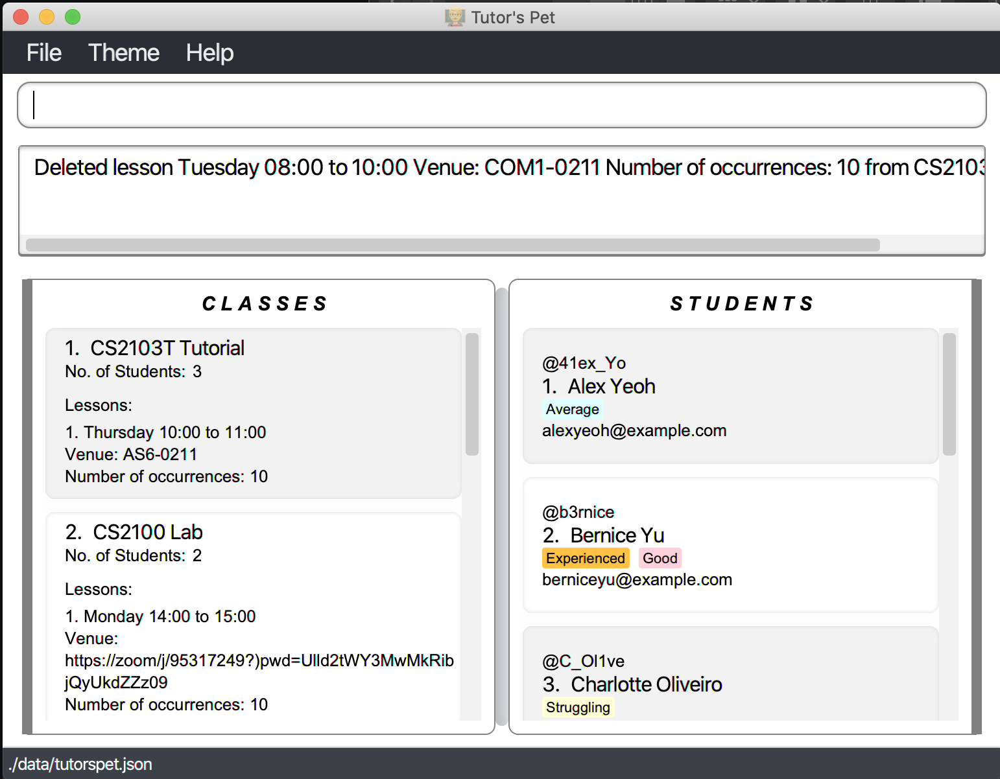

Other examples:
* `find-class CS2030 lab` 
  `delete-lesson c\1 l\1` 
  Deletes the 1st lesson of the 1st class in the results of the find class command.

:bulb: **Tip:** If you accidentally delete the wrong lesson, you can retrieve it back immediately using
the `undo` command. However, you cannot `undo` once you exit the application!

#### Display venue : `display-venue`

Gives you the venue of a lesson.

**Format**: `display-venue c\CLASS_INDEX l\LESSON_INDEX`
* Gives the venue of the lesson specified at `CLASS_INDEX` + `LESSON_INDEX`.

For example:
* Due to covid, most of your physical lessons have been converted to zoom lessons and thus all the venues are
  in the form of zoom links. Your lesson is starting in 10 minutes and it is time to start the session. Hence, you
  input the command `display-venue c\1 l\2` and press <kbd>Enter</kbd>.
* You can now proceed to copy the link to that zoom session from the command result box.

    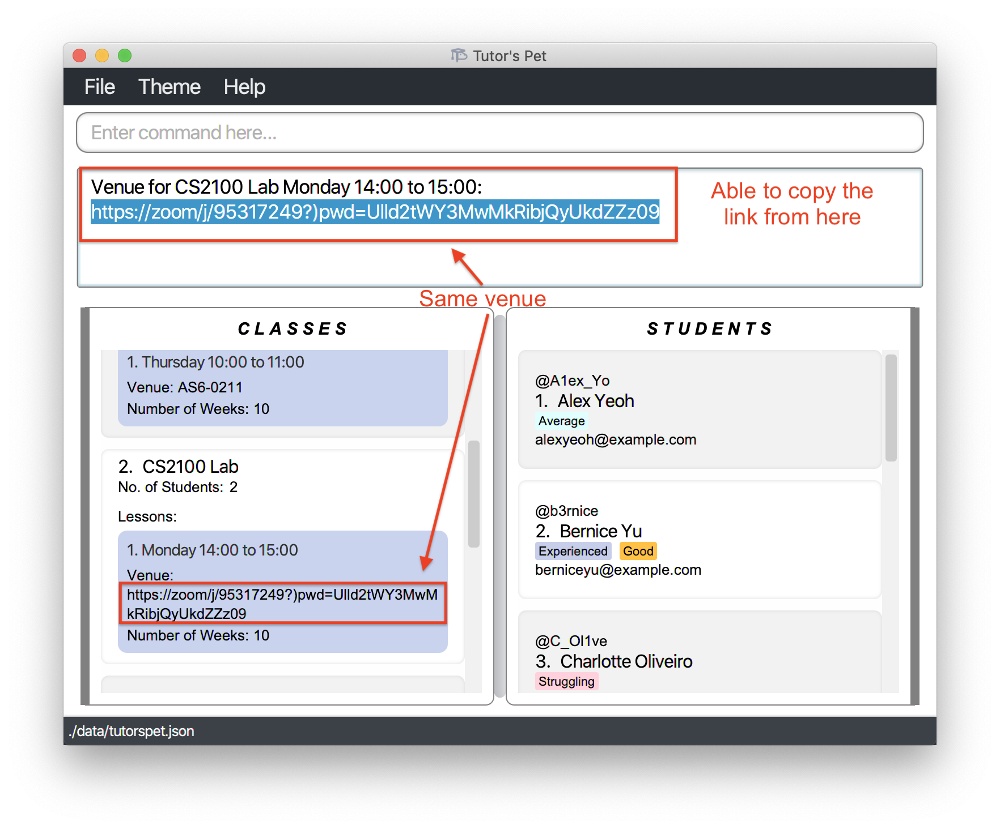

### Managing attendance records

#### Adding an attendance record : `add-attendance`

If you would like to record a new attendance for a student, you can make use of this command.

**Format**: `add-attendance c\CLASS_INDEX l\LESSON_INDEX s\STUDENT_INDEX w\WEEK p\PARTICIPATION_SCORE`

For example:
* Your `CS2103T Tutorial` lesson in week 10 has just ended and you would like to give participation scores to the
  students. You decide to start with Alex. Hence, you type in the command `add-attendance c\1 l\1 s\1 w\10 p\80` and
  press <kbd>Enter</kbd>.
* You have successfully recorded Alex's attendance. You have another 2 more students' attendance to record.

    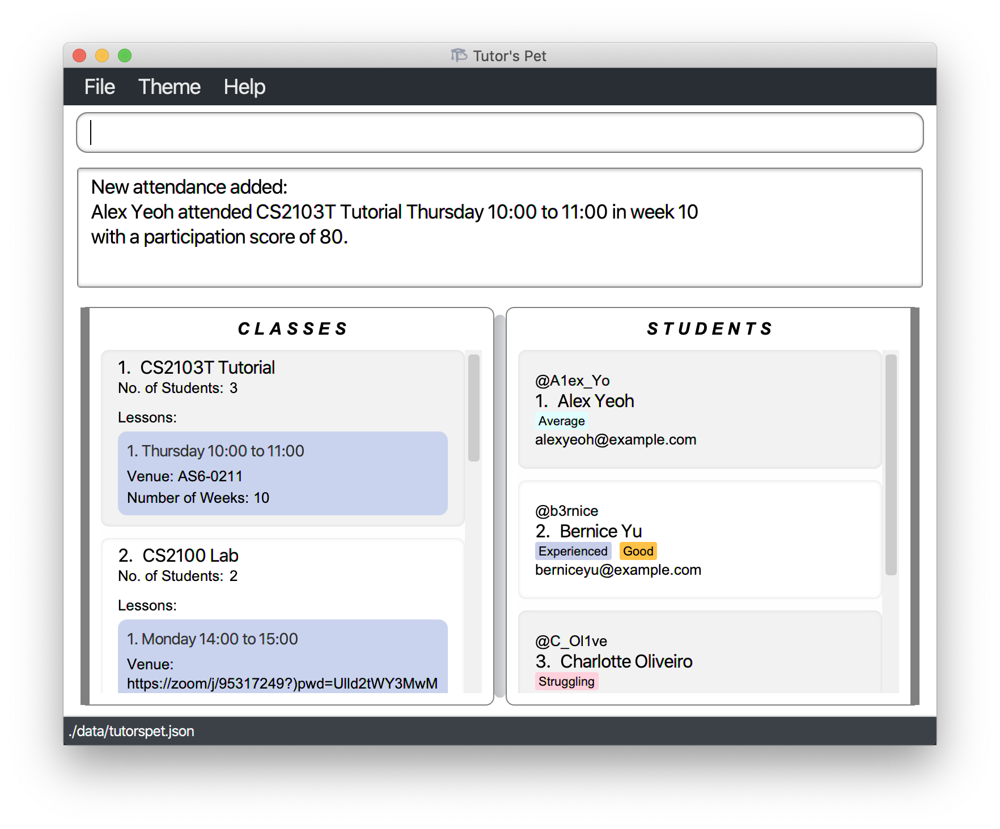

Other Examples:
* `find-class CS2100 lab` 
  `find-student bernice yu` 
  `add-attendance c\1 l\1 s\1 w\10 p\70` 
  Adds the attendance of the 1st student to the 1st lesson of the 1st class in the results of the find commands. 
  Attendance recorded is for week 10 and student's participation score is 70.

* `list-student c\1` 
  `add-attendance c\1 l\1 s\2 w\5 p\50` 
  Adds the attendance of the 2nd student in the results of the list command to the 1st lesson of the 1st class. 
  Attendance recorded is for week 5 and student's participation score is 50.

:bulb: **Tip:** If you are planning to add multiple attendances consecutively, click on the command
box and make use of the `recall` function by pressing <kbd>↑</kbd> key. This `recall` function automatically
inputs your most recent command into the command box allowing you to type less!

#### Editing an attendance record : `edit-attendance`

You can use this command to edit the attendance of a student.

**Format**: `edit-attendance c\CLASS_INDEX l\LESSON_INDEX s\STUDENT_INDEX w\WEEK p\PARTICIPATION_SCORE`
* Edits the attendance record at the specified `CLASS_INDEX` + `LESSON_INDEX` + `STUDENT_INDEX` + `WEEK`.

For example:
* Alex is a student in your CS2103T class. After your lesson in week 1, you wish to give him a participation score of 45.
  However, you accidentally gave him 35 instead. Hence, you can type in the command `edit-attendance c\1 l\1 s\1 w\1 p\45` and press <kbd>Enter</kbd>.

* Now you have successfully edited Alex's participation score from 35 to 45 points.

  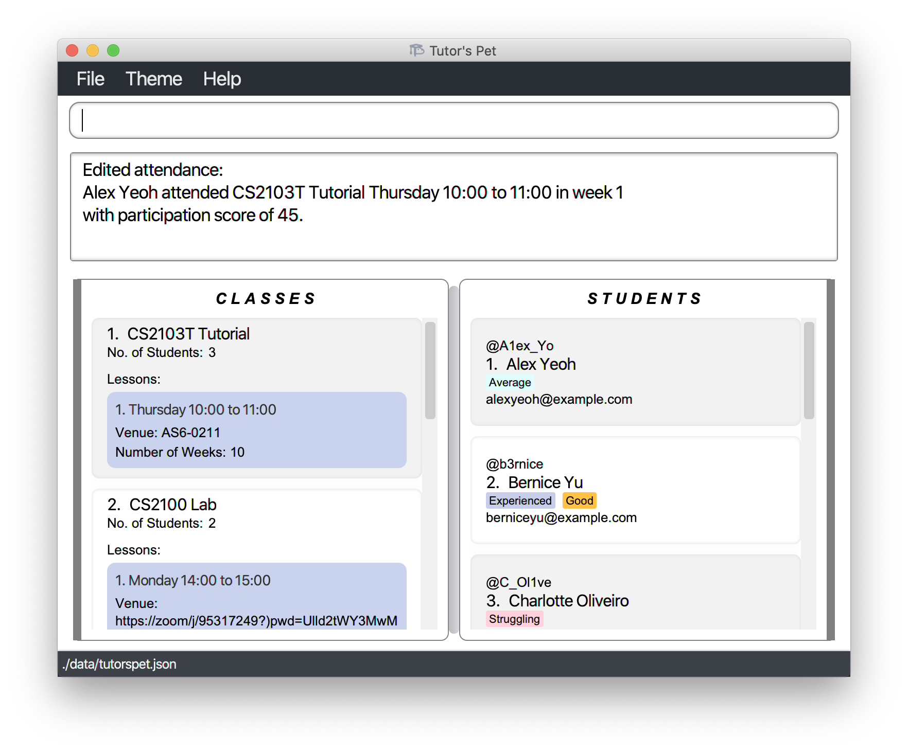

Other examples:
* `edit-attendance c\1 l\1 s\1 w\1 p\10`  
  Edits the 1st week's participation score of the 1st student of the 1st lesson of the 1st class to 10 points.

**:information_source: Notes about the command:** 
  * The `WEEK` **must be a positive whole number** 1, 2, 3, …​
  * The `PARTICIPATION_SCORE` **must be a non-negative whole number** 0, 1, 2, …​

#### Finding attendance record by indexes: `find-attendance`

If you need to find out a specific student's attendance for a specific week, make use of this command.

**Format**: `find-attendance c\CLASS_INDEX l\LESSON_INDEX s\STUDENT_INDEX w\WEEK`
* Finds the attendance record at the specified `CLASS_INDEX` + `LESSON_INDEX` + `STUDENT_INDEX` + `WEEK`.

For example:
* It is the end of a semester and it's time to key in your students' attendance into luminus. You would like to find
 out if Alex attended week 1 lesson and hence you type in the command `find-attendance c\1 l\1 s\1 w\1` and press
 <kbd>Enter</kbd>.
* Now you can find out if Alex attended the first lesson and how participative he was in week 1.

    

Other Examples:
* `find-class CS2100 lab` 
  `find-student bernice yu` 
  `find-attendance c\1 l\1 s\1 w\10` 
  Shows the attendance of the 1st student in the 1st lesson of the first class in the results of the find command. 
  Attendance shown is for week 10.

* `list-student c\1`
  `find-attendance c\1 l\1 s\2 w\5`
  Shows the attendance of the 2nd student in the 1st lesson of the first class in the results of the list command.
  Attendance shown is for week 5.

**:information_source: Notes about the command:** 
  * The `WEEK` **must be a positive whole number** 1, 2, 3, …​

#### Deleting an attendance record : `delete-attendance` -- Jun Long

If you would like to delete a specific student's attendance from a lesson, you can make use of this command.

**Format**: `delete-attendance c\CLASS_INDEX l\LESSON_INDEX s\STUDENT_INDEX w\WEEK`
* Deletes the attendance record at the specified `CLASS_INDEX` + `LESSON_INDEX` + `STUDENT_INDEX` + `WEEK`.

For example:
* You would like to delete Alice's attendance for the Thursday 10.00am to 11.00am lesson of CS2103T Tutorial
in Week 1. Hence, you type in the command `delete-attendance c\1 l\1 s\1 w\1` and press <kbd>Enter</kbd>.
* Alice's attendance for week 1 has been deleted.

    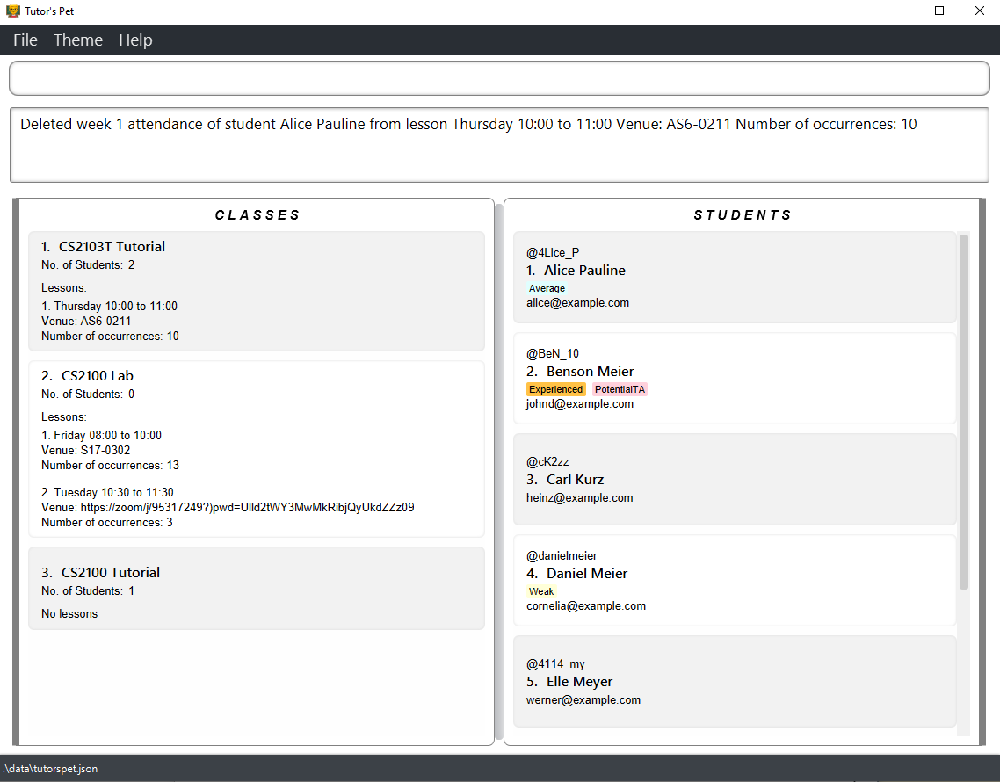

#### Display statistics : `stats`

Gives you an overall summary of a student's attendance and participation scores.

**Format**: `stats c\CLASS_INDEX s\STUDENT_INDEX`
* Gives a summary of the student's attendance at the specified `CLASS_INDEX` + `STUDENT_INDEX`.

For example:
* It is the end of the semester and time for you to grade a student's class participation. You would like to find out
 if Alex has been participative throughout the semester and hence you type in the command `stats c\1 s\1` and press
 <kbd>Enter</kbd>.
* Now you can see his average participation score and overall attendance to give a corresponding grade.

    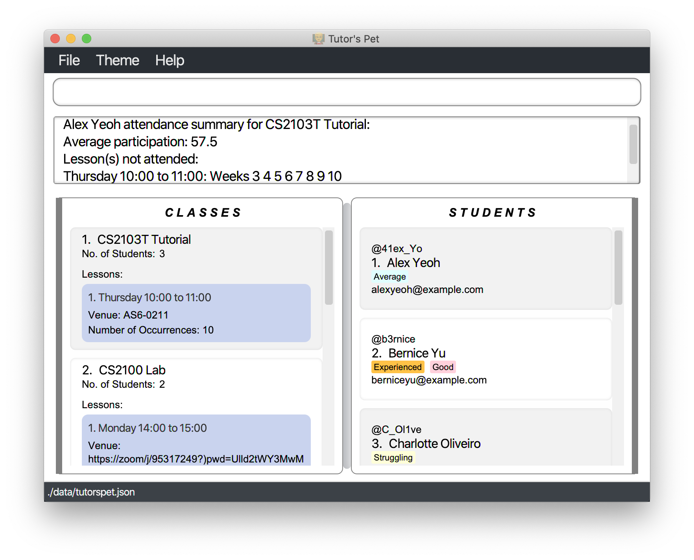

**:information_source: Notes about the command:** 
  * `Lesson(s) not attended` displays all lessons not attended by the student. This means that future lessons
    are also displayed.

--------------------------------------------------------------------------------------------------------------------

## FAQ

**Q**: How do I transfer my data to another Computer? 
**A**: Install the app in the other computer and overwrite the empty data file it creates with the file that contains the data of your previous Tutor's Pet home folder.

--------------------------------------------------------------------------------------------------------------------

## Glossary

This glossary provides definitions for the special terms used in this user guide.

* The `STUDENT_INDEX` refers to the index number shown in the displayed student list.
* The `CLASS_INDEX` refers to the index number shown in the displayed class list.
* The `LESSON_INDEX` refers to the index number of a lesson shown in its class.

--------------------------------------------------------------------------------------------------------------------
