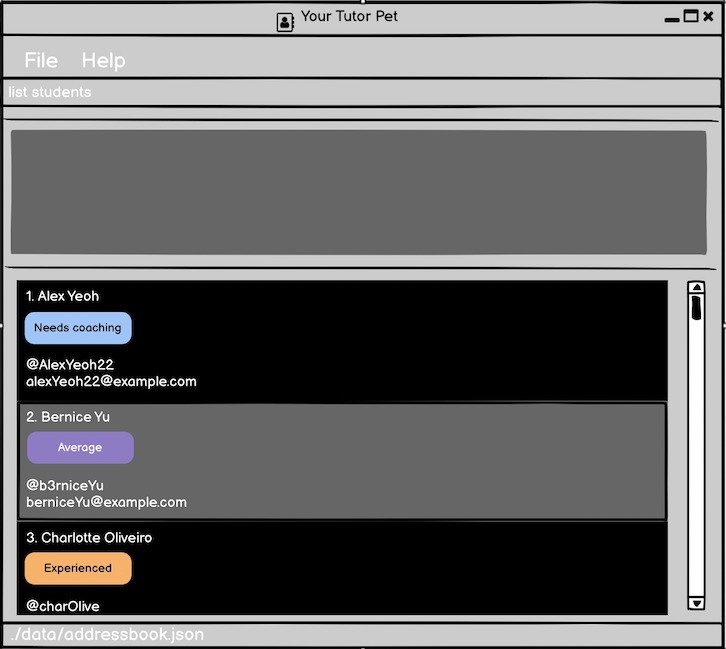

Tutor's Pet is a **desktop application for managing students and classes, optimised for use via a Command Line Interface** (CLI) while still having the benefits of a Graphical User Interface (GUI).
If you can type fast, Tutor's pet can get your class management tasks done faster than traditional GUI apps.

* Table of Contents
{:toc}

--------------------------------------------------------------------------------------------------------------------

## Quick start

1. Ensure you have Java `11` or above installed in your Computer.

2. Download the latest `tutorspet.jar`.

3. Copy the file to the folder you want to use as the _home folder_ for your Tutor's Pet.

4. Double-click the file to start the app. The GUI similar to the below should appear in a few seconds. Note how the app contains some sample data. 
   

5. Type the command in the command box and press Enter to execute it. e.g. typing **`help`** and pressing Enter will open the help window. 
   Some example commands you can try:

   * **`list`** : Lists all students.

   * **`add`**`n/John Doe t/@johndoe e/johnd@example.com tag/student` : Adds a student named `John Doe` to the application.

   * **`delete`**`3` : Deletes the 3rd student shown in the current list.

   * **`clear`** : Deletes all students.

   * **`exit`** : Exits the app.

6. Refer to the [Features](#features) below for details of each command.

--------------------------------------------------------------------------------------------------------------------

## Features

**:information_source: Notes about the command format:** 

* Words in `UPPER_CASE` are the parameters to be supplied by the user. 
  e.g. in `add n/NAME`, `NAME` is a parameter which can be used as `add n/John Doe`.

* Items in square brackets are optional. 
  e.g `n/NAME [tag/TAG]` can be used as `n/John Doe tag/student` or as `n/John Doe`.

* Items with `…​` after them can be used multiple times including zero times. 
  e.g. `[tag/TAG]…​` can be used as ` ` (i.e. 0 times), `tag/student`, `tag/average tag/TA candidate` etc.

* Parameters can be in any order. 
  e.g. if the command specifies `n/NAME p/PHONE_NUMBER`, `p/PHONE_NUMBER n/NAME` is also acceptable.

### Viewing help : `help`

Shows a message explaining how to access the help page.

Format: `help`

### Managing Students

#### Adding a student: `add`

Adds a student to the list of students.

Format: `add n/NAME t/TELEGRAM_HANDLE e/EMAIL [tag/TAG]…​`

:bulb: **Tip:**
A student can have any number of tags (including 0)

Examples:
* `add n/John Doe t/@johndoe e/johnd@example.com`
* `add n/Betsy Crowe t/@betsycrowe e/betsycrowe@example.com tag/student`

#### Listing all students : `list`

Shows a list of all students in the application.

Format: `list`

#### Editing a student : `edit`

Edits an existing student in the application.

Format: `edit INDEX [n/NAME] [t/TELEGRAM_HANDLE] [e/EMAIL] [tag/TAG]…​`

* Edits the student at the specified `INDEX`. The index refers to the index number shown in the displayed student list. The index **must be a positive integer** 1, 2, 3, …​
* At least one of the optional fields must be provided.
* Existing values will be updated to the input values.
* When editing tags, the existing tags of the student will be removed i.e adding of tags is not cumulative.
* You can remove all the student’s tags by typing `tag/` without
    specifying any tags after it.

Examples:
*  `edit 1 p/91234567 e/johndoe@example.com` Edits the phone number and email address of the 1st student to be `91234567` and `johndoe@example.com` respectively.
*  `edit 2 n/Betsy Crower t/` Edits the name of the 2nd student to be `Betsy Crower` and clears all existing tags.

#### Locating students by name: `find`

Finds students whose names contain any of the given keywords.

Format: `find KEYWORD [MORE_KEYWORDS]`

* The search is case-insensitive. e.g `hans` will match `Hans`
* The order of the keywords does not matter. e.g. `Hans Bo` will match `Bo Hans`
* Only the name is searched.
* Only full words will be matched e.g. `Han` will not match `Hans`
* Students matching at least one keyword will be returned (i.e. `OR` search).
  e.g. `Hans Bo` will return `Hans Gruber`, `Bo Yang`

Examples:
* `find John` returns `john` and `John Doe`
* `find alex david` returns `Alex Yeoh`, `David Li` 

#### Deleting a student : `delete`

Deletes the specified student from the application.

Format: `delete INDEX`

* Deletes the student at the specified `INDEX`.
* The index refers to the index number shown in the displayed student list.
* The index **must be a positive integer** 1, 2, 3, …​

Examples:
* `list` followed by `delete 2` deletes the 2nd student in the application.
* `find Betsy` followed by `delete 1` deletes the 1st student in the results of the `find` command.

#### Clearing all students : `clear`

Clears all students from the application.

Format: `clear`

### Managing Module Classes: [coming soon]

#### Adding a module class: `add-class`

Adds a module class to the application.

Format: `add-class c/CLASS_NAME`

Examples:
* `add-class c/CS2103T Tutorial T10`

#### Listing all students within a module class : `list-students`

Shows a list of all students within a particular module class in the application.

Format: `list-students c/CLASS_NAME`

Examples:
* `list-students c/CS2103T Tutorial T10`

#### Editing a module class : `edit-class`

Edits an existing module class in the application.

Format: `edit-class INDEX [c/CLASS_NAME]`

* Edits the module class at the specified `INDEX`. 
* The index refers to the index number shown in the displayed module class list. 
* The index **must be a positive integer** 1, 2, 3, …​
* A new module class name must be provided.

Examples:
*  `edit 1 c/CS2103T Tutorial T10` Edits the module class name of the 1st module class to be `CS2103T Tutorial T10`.

#### Deleting a module class: `delete-class`

Deletes the specified module class from the application.

Format: `delete-class INDEX`

* Deletes the module class at the specified `INDEX`.
* The index refers to the index number shown in the displayed module class list.
* The index **must be a positive integer** 1, 2, 3, …​

Examples:
* `delete-class 2` deletes the 2nd module class in the application.

#### Unlinking a student from a module class: `unlink`

Unlinks an existing student from an existing module class in the application.

Format: `unlink s/INDEX c/INDEX`

* Unlinks the student at the specified `INDEX` from the module class at the specified `INDEX`. 
* The index refers to the index number shown in the displayed student list and module class list respectively.
* The indexes **must be positive integers** 1, 2, 3, …​

Examples:
*  `unlink s/1 c/2` Unlinks the 1st student from the 2nd module class in the respective lists.

#### Clearing all module classes : `clear-class`

Clears all module classes from the application.

Format: `clear-class`

### Exiting the program : `exit`

Exits the program.

Format: `exit`

### Saving the data

Tutor's Pet automatically saves your data to your hard disk after any changes are made.
There is no need to save manually.

--------------------------------------------------------------------------------------------------------------------

## FAQ

**Q**: How do I transfer my data to another Computer? 
**A**: Install the app in the other computer and overwrite the empty data file it creates with the file that contains the data of your previous Tutor's Pet home folder.

--------------------------------------------------------------------------------------------------------------------

## Command summary

Action | Format, Examples
--------|------------------
**Add Student** | `add n/NAME t/TELEGRAM_HANDLE e/EMAIL [tag/TAG]…​`   e.g., `add n/John Doe t/@johndoe e/johnd@example.com tag/student`
**List All Students** | `list`
**Edit Student** | `edit INDEX [n/NAME] [t/TELEGRAM_HANDLE] [e/EMAIL] [tag/TAG]…​`  e.g.,`edit 2 n/James Lee e/jameslee@example.com`
**Find Student** | `find KEYWORD [MORE_KEYWORDS]`  e.g., `find James Jake`
**Delete Student** | `delete INDEX`  e.g., `delete 3`
**Clear All Students** | `clear`
**Add Module Class** | `add-class c/CLASS_NAME`  e.g., `add-class c/CS2103T Tutorial T10`
**List Students in a Module Class** | `list-students c/CLASS_NAME`  e.g., `list-students c/CS2103T Tutorial T10`
**Edit Module Class** | `edit-class INDEX [c/CLASS_NAME]`   e.g., `edit 1 c/CS2103T Tutorial T10`
**Delete Module Class** | `delete-class INDEX`  e.g., `delete-class 2`
**Unlink Student From a Module Class** | `unlink s/INDEX c/INDEX`   e.g., `unlink s/1 c/2`
**Clear All Module Classes** |`clear-class`
**Help** | `help`
